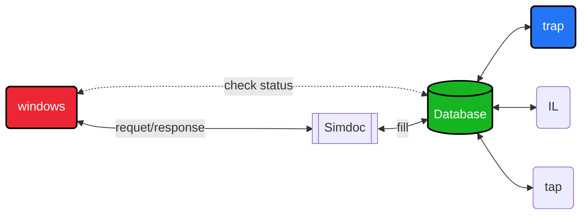

# TAP web API 🐝

REST API in python built with FLASK.  
The server is running with gunicorn.  
Python version : `Python 3.10.4`   
<!-- Branch : security -->

## 🔧  Installation  

```sh 
git clone ... 
cd Davinci 
chmod +x install.sh  
./install.sh  
```

*test if it works :*   
```sh
source venv/bin/activate  
python3 tests/client.py   
```


## 📚 Source 

[tutorial flask](https://www.youtube.com/watch?v=GMppyAPbLYk&ab_channel=TechWithTim)    
[tutorial gunicorn](https://www.digitalocean.com/community/tutorials/how-to-serve-flask-applications-with-gunicorn-and-nginx-on-ubuntu-20-04-fr)    
[tutorial sqlite/flask](https://youtu.be/HX-ChCQfJEo)    
 

## Roadmap  

<details open>
	<summary>TODO</summary>
	<br>
    - [ ] Link to DNS    <br>
    - [ ] Handle 400 | 403 | 500 | 404 errors    <br>
    - [ ] Securing the API    <br>
    - [x] Fix curl -X POST   <br>
 
</details>

## Diagram    




## 👤 About  


author : [vincent](https://www.github.com/Vincent-vst)   
release date : *not released yet*    
version : 1.3   

