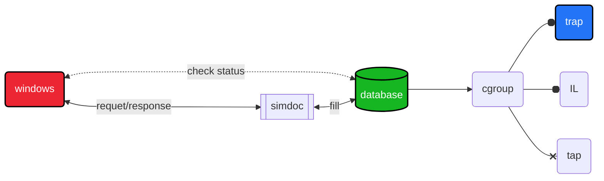

# 🐝 Davinci 

Davinci is a REST API in python built with FLASK.  
The server is running with gunicorn.  
Python version : `Python 3.10.4`   
<!-- Branch : security -->

## 🛠  Built with  
- Flask   
- SQLite   
- HTML/CSS/JS  
- Gunicorn   

## 🪛  Installation  

```sh 
git clone ... 
cd Davinci 
chmod +x install.sh  
./install.sh  
```

*test if it works :*   
```sh
source venv/bin/activate  
python3 tests/client.py   
```


## 📚 Source 

[tutorial flask](https://www.youtube.com/watch?v=GMppyAPbLYk&ab_channel=TechWithTim)    
[tutorial gunicorn](https://www.digitalocean.com/community/tutorials/how-to-serve-flask-applications-with-gunicorn-and-nginx-on-ubuntu-20-04-fr)    
[tutorial sqlite/flask](https://youtu.be/HX-ChCQfJEo)    
 

## 🚦 Roadmap  

<details open>
	<summary>TODO</summary>
	<!-- <br> -->
    - [ ] Link to DNS    <br>
    - [x] Handle 400 | 403 | 500 | 404 errors    <br>
    - [x] Securing the API    <br>
    - [x] Fix curl -X POST   <br>
		- [ ] check type() of request.post 
		- [ ] add "log" column in database 
		- [ ] send email when status="success"
</details>

## 📕 Diagram    



### Database schema  

| id `int` | user `varchar2(100)` | task `varchar2(100)` | pwd `varchar2(100)` | audio_sample `json` | priorité `int` | ETA `datetime` | status `varchar2(100)` |
| --- | --- | --- | --- | --- | --- | --- | --- |
| 1 | Tom | TRAP | ~/tmp/1.VIP | {"name":"Tom"} | 0 | 00:00:00 | succes |
| 2 | Lua | IL | ~/2.VIP | {"start":0.00} | 1 | 00:00:20 | pending |
| 3 | Louise | TAP  | /usr/3.VIP | {"len":3.00} | 2 | 00:20:00 | error |
| 4 | Ferris | TRAP | /tmp/4.VIP | {"start":0.20} | 0 | 00:00:28 | failure  |


## 📝 License  

Distributed under the MIT License. See LICENSE.txt for more information.   


## 👤 About  


author : [vincent](https://www.github.com/Vincent-vst)   
release date : *not released yet*    
version : 1.4

