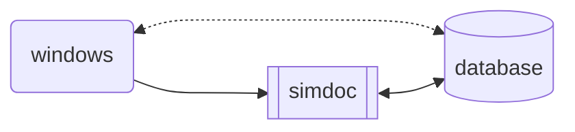

# Davinci 🐝

Davinci is a REST API in python built with FLASK.  
The server is running with gunicorn.  
The python version in `venv` is 3.8.10  
This branch is for the SQLite Database

## 🔧  Installation  

### API 

```sh 
git clone ... 
cd Davinci 
source venv/bin/activate
pip install -r requirements.txt
```

*on your server :*    
`python3 main.py` 
*or*   
`chmod +x install.sh; ./install.sh`  

*on your client :*   
`https://[your_ip]:5000`   
*or*   
`python3 src/client.py`   

### Database   

```sh   
sqlite3 davinci.db 
.mode column 
.headers on 
select * from workers   
``` 


## 📚 Source 

[tutorial flask](https://www.youtube.com/watch?v=GMppyAPbLYk&ab_channel=TechWithTim)   
[tutorial gunicorn](https://www.digitalocean.com/community/tutorials/how-to-serve-flask-applications-with-gunicorn-and-nginx-on-ubuntu-20-04-fr)   


## Roadmap  

<details open>
	<summary>TODO</summary>
	<br>
	- [ ] : add Database   
	- [ ] : change import of api.py   
	- [ ] : Link to DNS   
	- [ ] : Handle errors   
	- [ ] : Securing the API    
	- [ ] : Adding more route ?   
	- [ ] : Link API to trap     
</details>

## Diagram    




## 👤 About  


author : [vincent](https://www.github.com/Vincent-vst)   
release date : *not released yet*    
version : 1   


